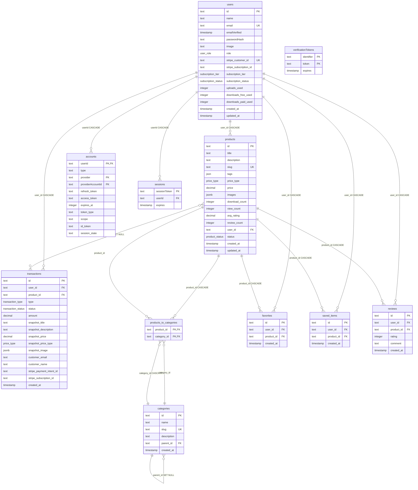

# pep-gallery

## 1. Project Overview

-  Gallery web app for sharing and selling digital assets with community features.

### Tech Stack

- **Framework**: Next.js 15
- **Database**: PostgreSQL (Neon serverless)
- **Authentication**: NextAuth V5
- **ORM**: Drizzle ORM with relations
- **Deployment**: Vercel

---

## 2. Authentication System & Database Integration

## How Authentication Works

- **Registration** : Form → Zod validation → Password hash → User created in DB
- **Login** : Credentials → Zod validation → bcrypt compare → Session created
- **OAuth** : Google/GitHub → Provider callback → User created/linked
- **Sessions** : Stored in DB via Drizzle Adapter, JWT tokens for auth state

# Authentication Flow


## Integration Points

- **NextAuth** ↔ **Drizzle Adapter** ↔ **Neon PostgreSQL**
- **Credentials**: Custom compareUserFromDb with bcrypt verification
- **OAuth**: Google & GitHub providers with account linking
- **Sessions**: Automatic management with DB storage

## Auth Providers

- **Credentials** (Email/Password)
- **Google OAuth**
- **GitHub OAuth**

## Core Functions & Paths

### Auth Configuration

- **File: [src/lib/auth/auth.ts](https://github.com/pepars-Rashid/pep-gallery/blob/main/src/lib/auth/auth.ts).**
- **Features: NextAuth config with Drizzle adapter, Credentials & OAuth providers**

### Database Schema

- **File: [src/database/schema.ts](https://github.com/pepars-Rashid/pep-gallery/blob/main/src/database/schema.ts)**
- **Tables:**

```
- users (lines 13-21): Main user table with auth & subscription fields
- (lines 171-209):
- accounts : OAuth provider connections
- sessions : User session management
- verificationTokens : Email verification tokens
```

### Helper Functions

- **Password Hashing**: [src/utils/auth/hash-passord.ts](https://github.com/pepars-Rashid/pep-gallery/blob/main/src/utils/auth/hash-passord.ts) - **saltAndHashPassword()**

- **User Verification**: [src/utils/auth/compare-user.ts](https://github.com/pepars-Rashid/pep-gallery/blob/main/src/utils/auth/compare-user.ts) - **compareUserFromDb()**

- **User Creation**: [src/utils/auth/create-user.ts](https://github.com/pepars-Rashid/pep-gallery/blob/main/src/utils/auth/create-user.ts) - **createUser()**

### Validation Schemas

- **File**: [src/lib/validation-schemas.ts](https://github.com/pepars-Rashid/pep-gallery/blob/main/src/lib/validation-schemas.ts)
- **Schemas**: **registerFormSchema**, **loginFormSchema** with Zod validation

### **Auth Triggers**

- **Sign up**:

```ts
// for credntials I used Create user helper function
// for provideors it's the same as sign in
```

- **Sign in**:

```ts
import { signIn, SignInResponse } from "next-auth/react";
// in the form component
// for credentials
(await signIn("credentials", {
  email: values.email,
  password: values.password,
  redirectTo: "/profile",
})) as SignInResponse | undefined;
// for provideors
signIn("github", { redirectTo: "/profile" });
signIn("google", { redirectTo: "/profile" });
```

- **Sign Out**:

```ts
await signOut();
```

- **Session Check**: (this is the server check)

```ts
  auth() from NextAuth
```

## 2. Database Schema & Structure

## Database Overview

- Neon PostgreSQL database with complex relationships for gallery management, user interactions, and hierarchical categories.



## Key Database Features

### 🔄 Hierarchical Categories

- **Self-referencing parent_id allows infinite category nesting**
- **Top-level categories have parent_id: null**
- **Example Structure:**

```
  Technology (id: 'tech', parentId: null)
├── Laptops (id: 'laptops', parentId: 'tech')
└── Phones (id: 'phones', parentId: 'tech')
```

**Benefit**:

- Flexible organization without multiple tables

### 🔗 Many-to-Many Relationships

- **Products ↔ Categories: Junction table products_to_categories**
- **Single product can belong to multiple categories**
- **Single category can contain multiple products**

### 🗑️ onDelete System

```
  USERS
├── ⬇️ ON DELETE: CASCADE
│   │
│   ├── PRODUCTS (user_id)
│   │   ├── ⬇️ ON DELETE: CASCADE
│   │   │   │
│   │   │   ├── TRANSACTIONS (product_id) → SET NULL
│   │   │   ├── PRODUCTS_TO_CATEGORIES (product_id) → CASCADE
│   │   │   ├── FAVORITES (product_id) → CASCADE
│   │   │   ├── SAVED_ITEMS (product_id) → CASCADE
│   │   │   └── REVIEWS (product_id) → CASCADE
│   │   │
│   ├── TRANSACTIONS (user_id) → CASCADE
│   ├── FAVORITES (user_id) → CASCADE
│   ├── SAVED_ITEMS (user_id) → CASCADE
│   ├── REVIEWS (user_id) → CASCADE
│   ├── ACCOUNTS (userId) → CASCADE
│   └── SESSIONS (userId) → CASCADE
│
CATEGORIES
├── ⬇️ ON DELETE: CASCADE
│   │
│   ├── PRODUCTS_TO_CATEGORIES (category_id) → CASCADE
│   └── SELF-REFERENCE: parent_id → SET NULL

```

### File Reference

**Schema Definition**: [src/database/schema.ts](https://github.com/pepars-Rashid/pep-gallery/blob/main/src/database/schema.ts)

**Relations**: Drizzle relations for type-safe queries (lines 211-311)

**Migrations**: Automatic schema versioning with drizzle push command:
```bash
npx drizzle-kit push
```

***This structure supports scalable gallery operations with proper data integrity and flexible content organization.***
_________________________________________


### This project still in progress under this plan:

